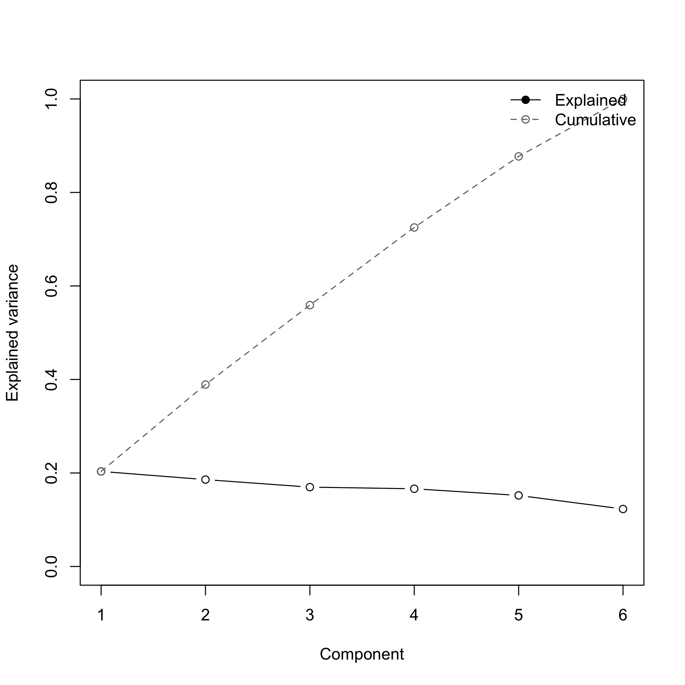
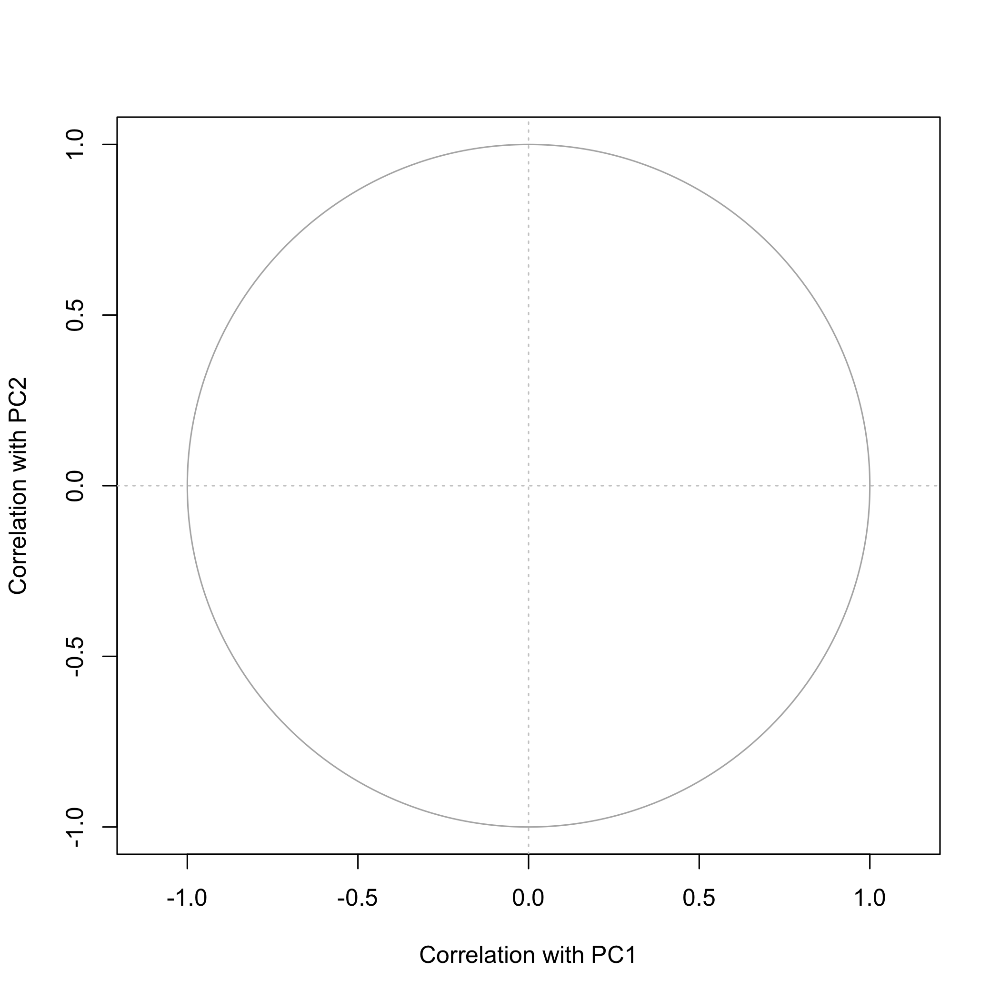

<!-- README.md is generated from README.Rmd. Please edit that file -->


# bigPCAcpp

# Principal component analysis for bigmemory matrices
## Frédéric Bertrand

<!-- badges: start -->
[](https://github.com/fbertran/bigPCAcpp/actions/workflows/R-CMD-check.yaml)
<!-- badges: end -->

The **bigPCAcpp** package provides high performance principal component
analysis (PCA) routines specialised for `bigmemory::big.matrix` objects.
It keeps data in bigmemory allocations from ingestion through
eigendecomposition so that very large matrices can be analysed without
copying them into base R matrices. In addition to the PCA core, the
package offers streaming helpers that write scores, loadings,
correlations, and contributions back into file-backed `big.matrix`
targets for integration with downstream pipelines.

Beyond classical PCA, the package ships with scalable SVD tools that can
process file-backed matrices block by block, and it includes robust PCA
and robust SVD routines that temper the influence of outliers while
remaining compatible with bigmemory workflows. For exploratory work on
large batches, a scalable PCA interface lets users extract leading
components without reading the full matrix into memory.

These workflows make it possible to analyse data sets that exceed the
available RAM while keeping numerical stability through double-precision
accumulation and LAPACK eigen decompositions. Current features include

* centring and scaling directly on `big.matrix` inputs,
* incremental score generation that avoids bringing data into memory,
* helpers to persist PCA diagnostics in file-backed storage,
* SVD utilities for dense and robust decompositions backed by
  `bigmemory`, and

## Installation

You can install the development version of **bigPCAcpp** from GitHub with:


``` r
# install.packages("devtools")
devtools::install_github("fbertran/bigPCAcpp")
#> Using GitHub PAT from the git credential store.
#> Skipping install of 'bigPCAcpp' from a github remote, the SHA1 (96d78ba1) has not changed since last install.
#>   Use `force = TRUE` to force installation
```

If you prefer a local source install, clone the repository and run:


``` r
R CMD build bigPCAcpp
R CMD INSTALL bigPCAcpp_0.0.1.tar.gz
```

## Options

The package defines several options to control numerical tolerances and
workspace allocation. They are prefixed with `bigPCAcpp.` and include:

Option | Default value | Description
--- | --- | ---
`bigPCAcpp.block_size` | `1000L` | Number of rows processed in each block when streaming scores through BLAS.
`bigPCAcpp.center_scale_epsilon` | `1e-8` | Lower bound applied when rescaling columns to avoid division instabilities.
`bigPCAcpp.progress` | `FALSE` | Emit progress updates when computing PCA on long-running jobs.

All options can be changed with `options()` at runtime. For example,
`options(bigPCAcpp.block_size = 5000L)` increases the streaming block size.

## Examples

The examples below demonstrate the bigmemory workflow and compare the
results with base R's `prcomp()` implementation.


``` r
library(bigmemory)
library(bigPCAcpp)

# Allocate a 1,000 x 25 big.matrix with simulated values
n <- 1000
p <- 25
bm <- bigmemory::big.matrix(n, p, type = "double")
bm[,] <- matrix(rnorm(n * p), nrow = n)

# Run PCA and extract eigenvalues and rotation
res <- pca_bigmatrix(bm, center = TRUE, scale. = TRUE)
#> Error in pca_bigmatrix(bm, center = TRUE, scale. = TRUE): unused argument (scale. = TRUE)
res$importance
#> NULL
res$rotation[1:5, 1:3]
#>               PC1        PC2          PC3
#> [1,] -0.003073288 0.01338726 -0.032045333
#> [2,]  0.003158180 0.02937183 -0.064792030
#> [3,]  0.010154078 0.02424991  0.006917535
#> [4,]  0.053023148 0.02069305  0.006256628
#> [5,] -0.007681460 0.02388392  0.018323235

# Generate PCA scores in bigmemory-backed storage
scores <- bigmemory::filebacked.big.matrix(n, ncol = 3, type = "double")
#> Error in bigmemory::filebacked.big.matrix(n, ncol = 3, type = "double"): You must specify a backing file
pca_scores_stream_bigmatrix(
  bm,
  scores,
  res$rotation[, 1:3],
  center = res$center,
  scale = res$scale
)
#> Error: `xpDest` must be a bigmemory::big.matrix or external pointer
scores[1:5, ]
#> NULL

# Compare with prcomp()
pr <- prcomp(bm[], center = TRUE, scale. = TRUE)
all.equal(unclass(pr$rotation)[, 1:3], res$rotation[, 1:3], tolerance = 1e-6)
#> [1] "Attributes: < Component \"dim\": Mean relative difference: 79 >"
#> [2] "Numeric: lengths (75, 6000) differ"
```

`pca_bigmatrix()` can also focus on a subset of leading components while
streaming the results into file-backed matrices. The following snippet stores the
first four principal components and keeps a running summary of their scores.


``` r
library(bigmemory)
library(bigPCAcpp)

set.seed(2025)
bm <- bigmemory::filebacked.big.matrix(nrow = 1500, ncol = 40, type = "double")
#> Error in bigmemory::filebacked.big.matrix(nrow = 1500, ncol = 40, type = "double"): You must specify a backing file
bm[,] <- matrix(rnorm(1500 * 40), nrow = 1500)
#> Error in SetElements.bm(x, i, j, value): Matrix dimensions do not agree with big.matrix instance set size.

# Request only the first four components
top_pca <- pca_bigmatrix(bm, center = TRUE, scale. = TRUE, ncomp = 4)
#> Error in pca_bigmatrix(bm, center = TRUE, scale. = TRUE, ncomp = 4): unused argument (scale. = TRUE)
top_pca$sdev
#> Error: object 'top_pca' not found

# Stream the corresponding scores into a file-backed allocation
scores_fb <- bigmemory::filebacked.big.matrix(nrow = nrow(bm), ncol = 4, type = "double")
#> Error in bigmemory::filebacked.big.matrix(nrow = nrow(bm), ncol = 4, type = "double"): You must specify a backing file
pca_scores_stream_bigmatrix(
  bm,
  scores_fb,
  top_pca$rotation[, 1:4],
  center = top_pca$center,
  scale = top_pca$scale
)
#> Error: object 'scores_fb' not found

# Inspect a lightweight summary without loading the entire matrix
colMeans(scores_fb[, 1:2])
#> Error: object 'scores_fb' not found
apply(scores_fb[, 1:2], 2, sd)
#> Error: object 'scores_fb' not found
```

To stream the diagnostics into `bigmemory`-backed matrices, use the
corresponding helper functions:


``` r
library(bigmemory)
library(bigPCAcpp)

n <- 1000
p <- 25
bm <- bigmemory::filebacked.big.matrix(n, p, type = "double")
#> Error in bigmemory::filebacked.big.matrix(n, p, type = "double"): You must specify a backing file
bm[,] <- matrix(rnorm(n * p), nrow = n)

rotation <- bigmemory::big.matrix(nrow = p, ncol = p)
loadings <- bigmemory::big.matrix(nrow = p, ncol = p)
correlations <- bigmemory::big.matrix(nrow = p, ncol = p)
contrib <- bigmemory::big.matrix(nrow = p, ncol = p)

pca_stream <- pca_stream_bigmatrix(bm, xpRotation = rotation, center = TRUE, scale = FALSE)
pca_variable_loadings_stream_bigmatrix(rotation, pca_stream$sdev, loadings)
#> <pointer: 0x1240bcac0>
pca_variable_correlations_stream_bigmatrix(rotation, pca_stream$sdev, correlations)
#> Error in pca_variable_correlations_stream_bigmatrix(rotation, pca_stream$sdev, : argument "xpDest" is missing, with no default
pca_variable_contributions_stream_bigmatrix(loadings, contrib)
#> <pointer: 0x1244e5480>
```

### Robust PCA and singular value decompositions

Robust workflows dampen the influence of outliers while retaining the
familiar PCA interface. The `pca_robust()` helper centres variables by the
median, optionally scales by the MAD, and relies on an iteratively
reweighted SVD to derive principal components. The same robust solver is
exposed directly via `svd_robust()` for use in custom pipelines, and the
streaming-friendly `svd_bigmatrix()` wrapper computes classical SVDs on
`big.matrix` objects without materialising dense copies in memory.


``` r
library(bigmemory)
library(bigPCAcpp)

set.seed(42)
mat <- matrix(rnorm(200), nrow = 40, ncol = 5)
mat[1, 1] <- 15  # introduce an outlier

# Robust PCA keeps the outlier from dominating the rotation
robust <- pca_robust(mat, ncomp = 3)
robust$explained_variance
#> [1] 0.5610379 0.2456267 0.1933353

# Classical PCA on the same data highlights the impact of the outlier
bm_small <- bigmemory::big.matrix(nrow = nrow(mat), ncol = ncol(mat), type = "double")
bm_small[,] <- mat
classical <- pca_bigmatrix(bm_small, center = TRUE, scale. = TRUE, ncomp = 3)
#> Error in pca_bigmatrix(bm_small, center = TRUE, scale. = TRUE, ncomp = 3): unused argument (scale. = TRUE)
cbind(classical = classical$rotation[1:5, 1], robust = robust$rotation[1:5, 1])
#> Error: object 'classical' not found

# Classical SVD on a file-backed big.matrix
bm <- bigmemory::filebacked.big.matrix(200, 10, type = "double")
#> Error in bigmemory::filebacked.big.matrix(200, 10, type = "double"): You must specify a backing file
bm[,] <- matrix(rnorm(2000), nrow = 200)
#> Error in SetElements.bm(x, i, j, value): Matrix dimensions do not agree with big.matrix instance set size.
svd_stream <- svd_bigmatrix(bm, nu = 3, nv = 3)
svd_stream$d
#>  [1] 36.26467 36.02548 35.11987 34.54261 34.18348 33.94098 33.44267 33.35246 32.58666 32.25824 32.11332 31.77055
#> [13] 31.48171 31.39417 30.61438 30.36906 30.12348 29.84740 29.67172 29.00646 28.67806 28.25614 27.99738 27.47180
#> [25] 27.08349

# Direct access to the robust SVD routine
svd_out <- svd_robust(mat, ncomp = 3)
svd_out$d
#> [1] 16.789433  6.178555  5.620833
svd_out$weights[1:6]
#> [1] 1 1 1 1 1 1
```

Robust decompositions down-weight the contaminated observations while the
classical stream demonstrates how to fetch singular vectors without materialising
the dense matrix. The robust solver also exposes per-row weights that can be
reused to flag problematic observations for further inspection.

### Plotting diagnostics

`bigPCAcpp` bundles plot helpers that operate on both dense matrices and
`big.matrix` backends. The snippets below illustrate how to call each
function using results from `pca_bigmatrix()`. For instance, the
`pca_plot_scores()` helper samples observations and draws a scatter plot of
their scores on a chosen pair of components, which is particularly useful when
you need to visually assess potential clusters without loading the full data
set into memory.


``` r
library(bigmemory)
library(bigPCAcpp)

set.seed(123)
bm <- bigmemory::big.matrix(500, 6, type = "double")
bm[,] <- matrix(rnorm(500 * 6), nrow = 500)
res <- pca_bigmatrix(bm, center = TRUE, scale. = TRUE)
#> Error in pca_bigmatrix(bm, center = TRUE, scale. = TRUE): unused argument (scale. = TRUE)

# Scree plot of explained variance
pca_plot_scree(res)
#> Error in pca_plot_scree(res): `pca_result` must contain `sdev` and `explained_variance` components

# Scatter plot of sampled scores on PCs 1 and 2
pca_plot_scores(
  bm,
  res$rotation,
  center = res$center,
  scale = res$scale,
  components = c(1L, 2L),
  max_points = 2000L,
  seed = 2024
)
#> Warning in sweep(block, 2, center, "-"): STATS is longer than the extent of 'dim(x)[MARGIN]'
#> Warning in sweep(block, 2, safe_scale, "/"): STATS is longer than the extent of 'dim(x)[MARGIN]'
#> Error in block %*% rot[, comps, drop = FALSE]: non-conformable arguments

# Contribution bar plot for the leading component
loadings <- pca_variable_loadings(res$rotation, res$sdev)
contrib <- pca_variable_contributions(loadings)
pca_plot_contributions(contrib, component = 1L, top_n = 10L)
```

<div class="figure">

<p class="caption">plot of chunk plotexamples</p>
</div>

``` r

# Correlation circle for the first two components
correlations <- pca_variable_correlations(res$rotation, res$sdev, res$column_sd)
#> Error: Not compatible with requested type: [type=NULL; target=double].
pca_plot_correlation_circle(correlations, components = c(1L, 2L))
```

<div class="figure">

<p class="caption">plot of chunk plotexamples</p>
</div>

``` r

# Biplot combining scores and loadings
scores <- res$scores
if (is.null(scores)) {
  scores <- pca_scores_bigmatrix(bm, res$rotation, center = res$center, scale = res$scale)
}
#> Error: Rotation matrix and big.matrix dimensions are incompatible
pca_plot_biplot(scores, loadings, components = c(1L, 2L))
#> Error in if (ncol_scores < max(comps)) {: argument is of length zero
```

## Citation

If you use **bigPCAcpp** in academic work, please cite:

Bertrand F. (2025). *bigPCAcpp: Principal Component Analysis for bigmemory Matrices*.

## Maintainer

Maintainer: Frédéric Bertrand <frederic.bertrand@lecnam.net>

For questions, bug reports, or contributions, please open an issue on
[GitHub](https://github.com/fbertran/bigPCAcpp).

