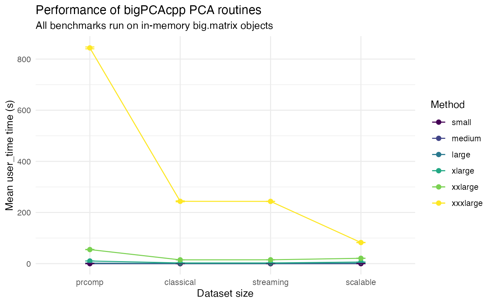
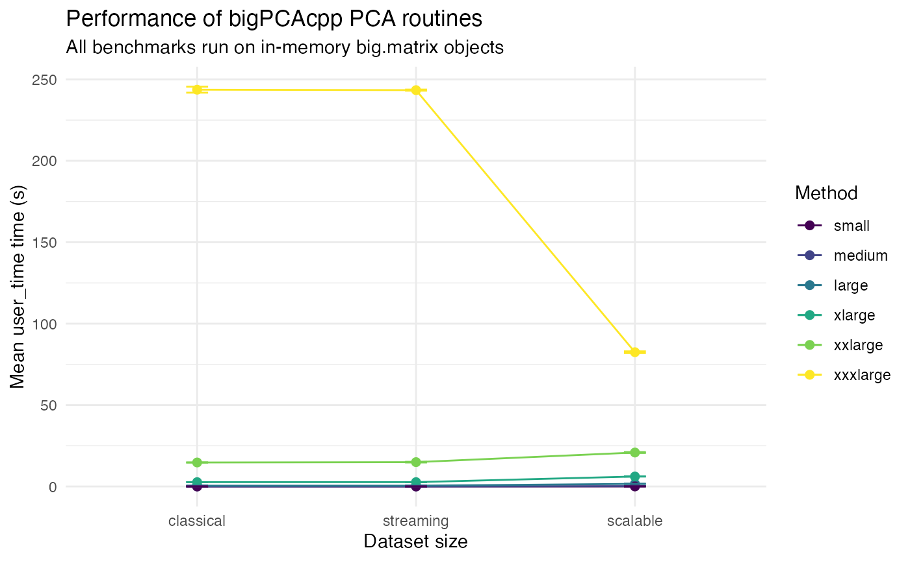

# Benchmarking bigPCAcpp Workflows

## Overview

This vignette summarises the performance of the principal component
analysis (PCA) routines provided by **bigPCAcpp** across matrices
ranging from small to very large dimensions. All experiments operate on
in-memory
\[[`bigmemory::big.matrix`](https://rdrr.io/pkg/bigmemory/man/big.matrix.html)\]
objects to avoid file-backed storage and a baseline using base R’s
\[[`stats::prcomp()`](https://rdrr.io/r/stats/prcomp.html)\] is included
for context. A focused
[`bench::mark()`](https://bench.r-lib.org/reference/mark.html)
comparison against
\[[`irlba::prcomp_irlba()`](https://rdrr.io/pkg/irlba/man/prcomp_irlba.html)\]
is also included for a smaller dense benchmark.

The large benchmark suite was executed once, and the resulting dataset
is stored in the package as `benchmark_results`. The summary analysis
below relies on that saved dataset so that the vignette can be built
quickly, while the focused `irlba` comparison is evaluated only when its
optional benchmark packages are available.

``` r
data("benchmark_results", package = "bigPCAcpp")
str(benchmark_results)
#> 'data.frame':    360 obs. of  14 variables:
#>  $ dataset    : chr  "small" "small" "small" "small" ...
#>  $ rows       : int  1000 1000 1000 1000 1000 1000 1000 1000 1000 1000 ...
#>  $ cols       : int  50 50 50 50 50 50 50 50 50 50 ...
#>  $ ncomp      : int  10 10 10 10 10 10 10 10 10 10 ...
#>  $ method     : chr  "classical" "classical" "classical" "classical" ...
#>  $ replicate  : int  1 2 3 4 5 6 7 8 9 10 ...
#>  $ user_time  : num  0.003 0.003 0.002 0.002 0.002 ...
#>  $ system_time: num  0.001 0 0 0 0 0 0 0 0 0 ...
#>  $ elapsed    : num  0.003 0.002 0.002 0.002 0.002 ...
#>  $ success    : logi  TRUE TRUE TRUE TRUE TRUE TRUE ...
#>  $ backend    : chr  "bigmemory" "bigmemory" "bigmemory" "bigmemory" ...
#>  $ iterations : int  NA NA NA NA NA NA NA NA NA NA ...
#>  $ converged  : logi  NA NA NA NA NA NA ...
#>  $ error      : chr  NA NA NA NA ...
```

## How the benchmarks were produced

The following chunk outlines the code that generated the stored results.
The chunk is not evaluated when building the vignette to keep
compilation times short, but it can be used to reproduce the dataset
manually.

``` r
suppressPackageStartupMessages({
  library(bigmemory)
  if (requireNamespace("bigPCAcpp", quietly = TRUE)) {
    library(bigPCAcpp)
  } else {
    if (!requireNamespace("pkgload", quietly = TRUE)) {
      stop("bigPCAcpp must be installed or pkgload must be available", call. = FALSE)
    }
    pkgload::load_all(".")
  }
})

sizes <- list(
  small = list(rows = 1000L, cols = 50L),
  medium = list(rows = 5000L, cols = 100L),
  large = list(rows = 20000L, cols = 200L),
  xlarge = list(rows = 50000L, cols = 300L),
  xxlarge = list(rows = 100000L, cols = 500L),
  xxxlarge = list(rows = 100000L, cols = 2000L)
)

method_runners <- list(
  classical = function(mats, ncomp) {
    pca_bigmatrix(mats$big, center = TRUE, scale = TRUE, ncomp = ncomp)
  },
  streaming = function(mats, ncomp) {
    pca_stream_bigmatrix(mats$big, center = TRUE, scale = TRUE, ncomp = ncomp)
  },
  scalable = function(mats, ncomp) {
    pca_spca(
      mats$big,
      ncomp = ncomp,
      center = TRUE,
      scale = TRUE,
      block_size = 2048L,
      max_iter = 25L,
      tol = 1e-4,
      seed = 42L,
      return_scores = FALSE,
      verbose = FALSE
    )
  },
  prcomp = function(mats, ncomp) {
    stats::prcomp(
      mats$dense,
      center = TRUE,
      scale. = TRUE,
      rank. = ncomp
    )
  }
)

replicates_for <- function(rows) {
  if (rows <= 5000L) {
    20L
  } else if (rows <= 20000L) {
    20L
  } else {
    10L
  }
}

results <- list()
row_id <- 1L
set.seed(123)

for (dataset_name in names(sizes)) {
  dims <- sizes[[dataset_name]]
  message(sprintf("Generating dataset '%s' with %d rows and %d columns", dataset_name, dims$rows, dims$cols))
  mat <- matrix(rnorm(dims$rows * dims$cols), nrow = dims$rows, ncol = dims$cols)
  big_mat <- bigmemory::as.big.matrix(mat, type = "double")
  ncomp <- min(10L, dims$cols)
  reps <- replicates_for(dims$rows)
  inputs <- list(dense = mat, big = big_mat)
  
  for (method_name in names(method_runners)) {
    runner <- method_runners[[method_name]]
    for (rep in seq_len(reps)) {
      gc()
      gc()
      message(sprintf("Running %s (replicate %d/%d) on %s", method_name, rep, reps, dataset_name))
      res <- NULL
      timing <- system.time({
        res <<- tryCatch(
          runner(inputs, ncomp),
          error = function(e) e
        )
      })
      success <- !inherits(res, "error")
      backend <- if (success) {
        backend_val <- attr(res, "backend", exact = TRUE)
        if (is.null(backend_val) && !is.null(res$backend)) {
          res$backend
        } else {
          backend_val
        }
      } else {
        NA_character_
      }
      iterations <- if (success) {
        iter <- attr(res, "iterations", exact = TRUE)
        if (is.null(iter)) NA_integer_ else as.integer(iter)
      } else {
        NA_integer_
      }
      converged <- if (success) {
        conv <- attr(res, "converged", exact = TRUE)
        if (is.null(conv)) NA else as.logical(conv)
      } else {
        NA
      }
      results[[row_id]] <- data.frame(
        dataset = dataset_name,
        rows = dims$rows,
        cols = dims$cols,
        ncomp = ncomp,
        method = method_name,
        replicate = rep,
        user_time = unname(timing[["user.self"]]),
        system_time = unname(timing[["sys.self"]]),
        elapsed = unname(timing[["elapsed"]]),
        success = success,
        backend = if (is.null(backend)) NA_character_ else as.character(backend),
        iterations = iterations,
        converged = converged,
        error = if (success) NA_character_ else conditionMessage(res),
        stringsAsFactors = FALSE
      )
      row_id <- row_id + 1L
    }
  }
  rm(mat, big_mat)
  gc()
  gc()
}

benchmark_results <- do.call(rbind, results)

if (!dir.exists("data")) {
  dir.create("data")
}

save(benchmark_results, file = file.path("data", "benchmark_results.rda"), compress = "bzip2")
```

## Focused comparison with `irlba`

The large benchmark suite above uses repeated
[`system.time()`](https://rdrr.io/r/base/system.time.html) calls so it
scales to very large matrices. For a smaller in-memory problem, the
script `scripts/run_benchmark_irlba.R` provides a higher-resolution
comparison between
[`pca_bigmatrix()`](https://fbertran.github.io/bigPCAcpp/reference/pca_bigmatrix.md)
and
\[[`irlba::prcomp_irlba()`](https://rdrr.io/pkg/irlba/man/prcomp_irlba.html)\]
using [`bench::mark()`](https://bench.r-lib.org/reference/mark.html).

``` r
set.seed(2025)
bm <- bigmemory::big.matrix(nrow = 2500, ncol = 40, type = "double")
m <- matrix(rnorm(2500 * 40), nrow = 2500)
bm[,] <- m

bench::mark(
  bigpca = bigPCAcpp::pca_bigmatrix(
    bm,
    center = TRUE,
    scale = TRUE,
    ncomp = 4
  )$dev,
  irlba = irlba::prcomp_irlba(
    m,
    n = 4,
    center = TRUE,
    scale. = TRUE
  )$dev,
  min_iterations = 200
)
#> # A tibble: 2 × 6
#>   expression      min   median `itr/sec` mem_alloc `gc/sec`
#>   <bch:expr> <bch:tm> <bch:tm>     <dbl> <bch:byt>    <dbl>
#> 1 bigpca     372.94µs  476.4µs     2096.   98.85KB     2.00
#> 2 irlba        2.39ms   2.69ms      369.    2.79MB    23.5
```

## Summary statistics

Only successful runs are retained for the summaries. Replicate counts
vary with matrix size (twenty runs for matrices up to 20,000 rows then
tens runs).

``` r
successful <- benchmark_results[benchmark_results$success, ]
method_levels <- c("prcomp", "classical", "streaming", "scalable")
successful$method <- factor(successful$method, levels = method_levels, ordered = TRUE)
mean_user_time <- aggregate(user_time ~ dataset + method, successful, mean)
colnames(mean_user_time)[colnames(mean_user_time) == "user_time"] <- "mean_user_time"

sd_user_time <- aggregate(user_time ~ dataset + method, successful, sd)
colnames(sd_user_time)[colnames(sd_user_time) == "user_time"] <- "sd_user_time"

rep_counts <- aggregate(replicate ~ dataset + method, successful, length)
colnames(rep_counts)[colnames(rep_counts) == "replicate"] <- "n_runs"

summary_table <- Reduce(
  function(x, y) merge(x, y, by = c("dataset", "method"), all = TRUE),
  list(mean_user_time, sd_user_time, rep_counts)
)

summary_table$sd_user_time[summary_table$n_runs <= 1] <- NA_real_
summary_table$method <- factor(summary_table$method, levels = method_levels)

mean_user_time$dataset <- factor(mean_user_time$dataset,levels = c("small", "medium", "large", "xlarge", "xxlarge", "xxxlarge"),ordered = TRUE)

summary_table <- summary_table[order(summary_table$dataset,summary_table$method),]
knitr::kable(
  summary_table,
  digits = 3,
  caption = "user_time time summaries (seconds) by dataset size and method."
)
```

|     | dataset  | method    | mean_user_time | sd_user_time | n_runs |
|:----|:---------|:----------|---------------:|-------------:|-------:|
| 2   | large    | prcomp    |          1.861 |        0.031 |     20 |
| 1   | large    | classical |          0.477 |        0.001 |     20 |
| 4   | large    | streaming |          0.477 |        0.001 |     20 |
| 3   | large    | scalable  |          1.623 |        0.006 |     20 |
| 6   | medium   | prcomp    |          0.115 |        0.001 |     20 |
| 5   | medium   | classical |          0.031 |        0.000 |     20 |
| 8   | medium   | streaming |          0.031 |        0.000 |     20 |
| 7   | medium   | scalable  |          0.199 |        0.000 |     20 |
| 10  | small    | prcomp    |          0.007 |        0.000 |     20 |
| 9   | small    | classical |          0.002 |        0.000 |     20 |
| 12  | small    | streaming |          0.002 |        0.000 |     20 |
| 11  | small    | scalable  |          0.020 |        0.000 |     20 |
| 14  | xlarge   | prcomp    |         10.249 |        0.029 |     10 |
| 13  | xlarge   | classical |          2.665 |        0.004 |     10 |
| 16  | xlarge   | streaming |          2.667 |        0.012 |     10 |
| 15  | xlarge   | scalable  |          6.128 |        0.012 |     10 |
| 18  | xxlarge  | prcomp    |         54.970 |        0.563 |     10 |
| 17  | xxlarge  | classical |         14.744 |        0.085 |     10 |
| 20  | xxlarge  | streaming |         14.949 |        0.208 |     10 |
| 19  | xxlarge  | scalable  |         20.850 |        0.280 |     10 |
| 22  | xxxlarge | prcomp    |        843.754 |        3.599 |     10 |
| 21  | xxxlarge | classical |        243.675 |        1.836 |     10 |
| 24  | xxxlarge | streaming |        243.400 |        0.360 |     10 |
| 23  | xxxlarge | scalable  |         82.468 |        0.540 |     10 |

user_time time summaries (seconds) by dataset size and method.

``` r

summary_table2 <- summary_table[order(summary_table$method,summary_table$dataset),]
knitr::kable(
  summary_table2,
  digits = 3,
  caption = "user_time time summaries (seconds) by dataset size and method."
)
```

|     | dataset  | method    | mean_user_time | sd_user_time | n_runs |
|:----|:---------|:----------|---------------:|-------------:|-------:|
| 2   | large    | prcomp    |          1.861 |        0.031 |     20 |
| 6   | medium   | prcomp    |          0.115 |        0.001 |     20 |
| 10  | small    | prcomp    |          0.007 |        0.000 |     20 |
| 14  | xlarge   | prcomp    |         10.249 |        0.029 |     10 |
| 18  | xxlarge  | prcomp    |         54.970 |        0.563 |     10 |
| 22  | xxxlarge | prcomp    |        843.754 |        3.599 |     10 |
| 1   | large    | classical |          0.477 |        0.001 |     20 |
| 5   | medium   | classical |          0.031 |        0.000 |     20 |
| 9   | small    | classical |          0.002 |        0.000 |     20 |
| 13  | xlarge   | classical |          2.665 |        0.004 |     10 |
| 17  | xxlarge  | classical |         14.744 |        0.085 |     10 |
| 21  | xxxlarge | classical |        243.675 |        1.836 |     10 |
| 4   | large    | streaming |          0.477 |        0.001 |     20 |
| 8   | medium   | streaming |          0.031 |        0.000 |     20 |
| 12  | small    | streaming |          0.002 |        0.000 |     20 |
| 16  | xlarge   | streaming |          2.667 |        0.012 |     10 |
| 20  | xxlarge  | streaming |         14.949 |        0.208 |     10 |
| 24  | xxxlarge | streaming |        243.400 |        0.360 |     10 |
| 3   | large    | scalable  |          1.623 |        0.006 |     20 |
| 7   | medium   | scalable  |          0.199 |        0.000 |     20 |
| 11  | small    | scalable  |          0.020 |        0.000 |     20 |
| 15  | xlarge   | scalable  |          6.128 |        0.012 |     10 |
| 19  | xxlarge  | scalable  |         20.850 |        0.280 |     10 |
| 23  | xxxlarge | scalable  |         82.468 |        0.540 |     10 |

user_time time summaries (seconds) by dataset size and method.

## Visual comparison

The plot below compares the average elapsed user time for each method
across the simulated datasets. Error bars denote one standard deviation
when multiple replicates are available.

``` r
if (requireNamespace("ggplot2", quietly = TRUE)) {
  library(ggplot2)
  plot_data <- summary_table
  plot_data$dataset <- factor(plot_data$dataset, levels = c("small", "medium", "large", "xlarge", "xxlarge", "xxxlarge"),ordered = TRUE)
  plot_data$method <- factor(plot_data$method, levels = method_levels)

  ggplot(plot_data, aes(x = dataset, y = mean_user_time, colour = method, group = method)) +
    geom_line() +
    geom_point(size = 2) +
    geom_errorbar(
      aes(ymin = mean_user_time - sd_user_time, ymax = mean_user_time + sd_user_time),
      width = 0.1,
      na.rm = TRUE
    ) +
    labs(
      x = "Dataset size",
      y = "Mean user_time time (s)",
      colour = "Method",
      title = "Performance of bigPCAcpp PCA routines",
      subtitle = "All benchmarks run on in-memory big.matrix objects"
    ) +
    theme_minimal()
  
    ggplot(plot_data, aes(x = method, y = mean_user_time, colour = dataset, group = dataset)) +
    geom_line() +
    geom_point(size = 2) +
    geom_errorbar(
      aes(ymin = mean_user_time - sd_user_time, ymax = mean_user_time + sd_user_time),
      width = 0.1,
      na.rm = TRUE
    ) +
    labs(
      x = "Dataset size",
      y = "Mean user_time time (s)",
      colour = "Method",
      title = "Performance of bigPCAcpp PCA routines",
      subtitle = "All benchmarks run on in-memory big.matrix objects"
    ) +
    theme_minimal()
} else {
  message("ggplot2 is not installed; skipping the benchmark plot.")
}
```



Without the `prcomp` baseline to zoom on the results of the three other
algorithms.

``` r
if (requireNamespace("ggplot2", quietly = TRUE)) {
  library(ggplot2)
  plot_data <- subset(summary_table, summary_table$method!="prcomp")
  plot_data$dataset <- factor(plot_data$dataset, levels = c("small", "medium", "large", "xlarge", "xxlarge", "xxxlarge"),ordered = TRUE)
  plot_data$method <- factor(plot_data$method, levels = method_levels)

  ggplot(plot_data, aes(x = dataset, y = mean_user_time, colour = method, group = method)) +
    geom_line() +
    geom_point(size = 2) +
    geom_errorbar(
      aes(ymin = mean_user_time - sd_user_time, ymax = mean_user_time + sd_user_time),
      width = 0.1,
      na.rm = TRUE
    ) +
    labs(
      x = "Dataset size",
      y = "Mean user_time time (s)",
      colour = "Method",
      title = "Performance of bigPCAcpp PCA routines",
      subtitle = "All benchmarks run on in-memory big.matrix objects"
    ) +
    theme_minimal()
  
    ggplot(plot_data, aes(x = method, y = mean_user_time, colour = dataset, group = dataset)) +
    geom_line() +
    geom_point(size = 2) +
    geom_errorbar(
      aes(ymin = mean_user_time - sd_user_time, ymax = mean_user_time + sd_user_time),
      width = 0.1,
      na.rm = TRUE
    ) +
    labs(
      x = "Dataset size",
      y = "Mean user_time time (s)",
      colour = "Method",
      title = "Performance of bigPCAcpp PCA routines",
      subtitle = "All benchmarks run on in-memory big.matrix objects"
    ) +
    theme_minimal()
} else {
  message("ggplot2 is not installed; skipping the benchmark plot.")
}
```



## Session information

``` r
sessionInfo()
#> R version 4.5.2 (2025-10-31)
#> Platform: aarch64-apple-darwin20
#> Running under: macOS Sonoma 14.7.1
#> 
#> Matrix products: default
#> BLAS:   /System/Library/Frameworks/Accelerate.framework/Versions/A/Frameworks/vecLib.framework/Versions/A/libBLAS.dylib 
#> LAPACK: /Library/Frameworks/R.framework/Versions/4.5-arm64/Resources/lib/libRlapack.dylib;  LAPACK version 3.12.1
#> 
#> locale:
#> [1] en_US.UTF-8/en_US.UTF-8/en_US.UTF-8/C/en_US.UTF-8/en_US.UTF-8
#> 
#> time zone: Europe/Paris
#> tzcode source: internal
#> 
#> attached base packages:
#> [1] stats     graphics  grDevices utils     datasets  methods   base     
#> 
#> other attached packages:
#> [1] ggplot2_4.0.2
#> 
#> loaded via a namespace (and not attached):
#>  [1] sass_0.4.10         utf8_1.2.6          generics_0.1.4     
#>  [4] lattice_0.22-7      bigmemory_4.6.4     digest_0.6.39      
#>  [7] magrittr_2.0.4      evaluate_1.0.5      grid_4.5.2         
#> [10] RColorBrewer_1.1-3  fastmap_1.2.0       jsonlite_2.0.0     
#> [13] Matrix_1.7-4        bench_1.1.4         bigmemory.sri_0.1.8
#> [16] viridisLite_0.4.3   scales_1.4.0        textshaping_1.0.4  
#> [19] jquerylib_0.1.4     cli_3.6.5           rlang_1.1.7        
#> [22] bigPCAcpp_0.9.1     withr_3.0.2         cachem_1.1.0       
#> [25] yaml_2.3.12         otel_0.2.0          tools_4.5.2        
#> [28] uuid_1.2-2          dplyr_1.2.0         profmem_0.7.0      
#> [31] vctrs_0.7.1         R6_2.6.1            lifecycle_1.0.5    
#> [34] fs_1.6.6            htmlwidgets_1.6.4   ragg_1.5.0         
#> [37] irlba_2.3.7         pkgconfig_2.0.3     desc_1.4.3         
#> [40] pkgdown_2.2.0       pillar_1.11.1       bslib_0.10.0       
#> [43] gtable_0.3.6        glue_1.8.0          Rcpp_1.1.1         
#> [46] systemfonts_1.3.1   xfun_0.56           tibble_3.3.1       
#> [49] tidyselect_1.2.1    rstudioapi_0.18.0   knitr_1.51         
#> [52] farver_2.1.2        htmltools_0.5.9     labeling_0.4.3     
#> [55] rmarkdown_2.30      compiler_4.5.2      S7_0.2.1
```
